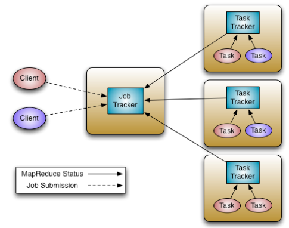
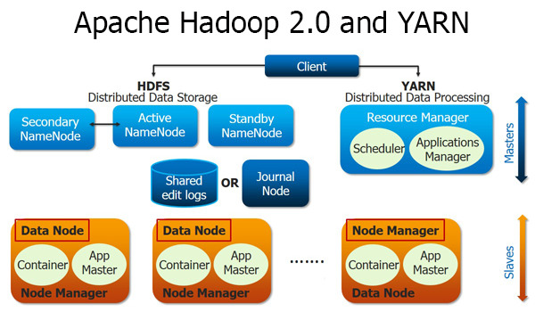
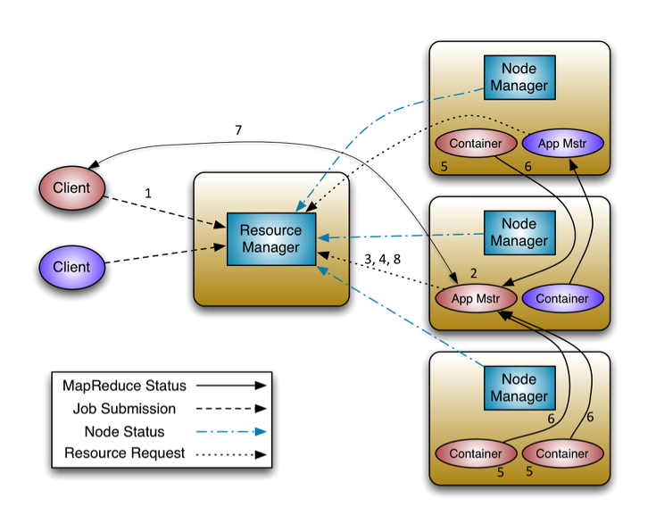

Hadoop
======

하둡1.0 구성요소
---------------


출처: http://skccblog.tistory.com/1883


하둡1.0 동작방식
---------------
  

출처 : http://www.edureka.in/blog/introduction-to-hadoop-2-0-and-advantages-of-hadoop-2-0/

하둡2.0 구성요소
---------------
> YARN(Yet Another Resource Negotiator) 



출처: http://skccblog.tistory.com/1883

하둡1.0 동작방식
---------------
  

출처 : http://hortonworks.com/blog/apache-hadoop-yarn-concepts-and-applications/

HDFS
----

### HDFS 실행 

```
$ $HADOOP_HOME/bin/start-dfs.sh
$ $HADOOP_HOME/bin/start-mapred.sh
```

### HDFS 관리 페이지

#### NameNode
```
$ http://52.78.23.190:50070/dfshealth.jsp
```

#### Hadoop Map/Reduce Administration
```
$ http://52.78.23.190:50030/jobtracker.jsp
```

HBase
-----

### HBase 실행
```
$ start-hbase.sh
$ hbase shell
```

### HBase 관리콘솔

```
http://192.168.33.10:60010
```

### HBase table creation

```
> list
> create 'table', 'cf'
> put 'table', 'row1', 'cf', 'value1'
> get 'table', 'row1'
> scan 'table'
```

### HBase table export & import

#### Export
```
$ hbase org.apache.hadoop.hbase.mapreduce.Import "table" /home/ndap/test
```

#### Import
```
$ hbase org.apache.hadoop.hbase.mapreduce.Export "table" /home/ndap/test
```
